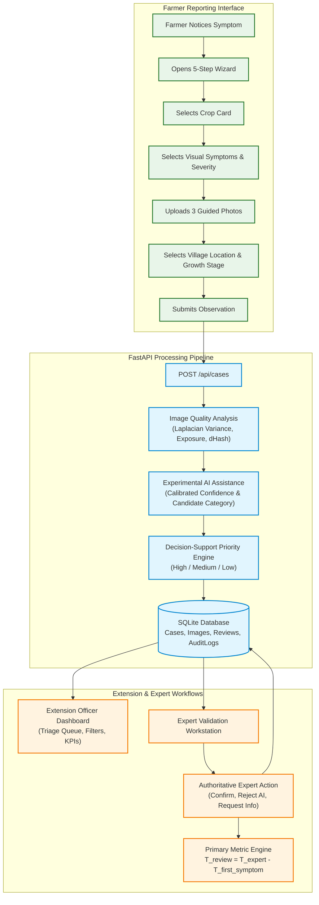

# System Architecture Specification

**Project:** Agricultural Disease Observation & Expert Escalation System  
**Review:** Review 1 (~35% Scope)  

---

## 1. Architectural Overview

The system provides a standardized vertical slice connecting smallholder farmers, extension officers, and expert plant pathologists. It enforces privacy preservation, real-time photographic quality checking, calibrated experimental AI assistance, and authoritative expert override.

---

## 2. ASCII Architecture Diagram

```
+-------------------------------------------------------------------------------------------------+
|                                        FARMER MOBILE / WEB UI                                   |
|  - 5-Step Intuitive Wizard (Crop -> Symptoms -> Visual Photos -> Location/Stage -> Submit)      |
|  - Real-time client & server-assisted photo quality feedback (Blur, Exposure, Crop Visibility)  |
|  - Zero PII collection (Anonymous Case ID: CASE-2026-001, Anonymous Farmer ID)                  |
+-------------------------------------------------------------------------------------------------+
                                                |
                                    HTTPS / REST POST /api/cases
                                                v
+-------------------------------------------------------------------------------------------------+
|                                      FASTAPI OBSERVATION ENGINE                                 |
|                                                                                                 |
|   +--------------------------+    +--------------------------+    +--------------------------+  |
|   |   Image Quality Engine   |    |  Experimental AI Engine  |    | Priority Scoring Engine  |  |
|   |  - Laplacian Sharpness   |    |  - Non-authoritative     |    |  - Severity weight       |  |
|   |  - Exposure (40 - 225)   |--->|  - Calibrated Confidence |--->|  - Growth Stage risk     |  |
|   |  - Vegetation Ratio      |    |  - Conf < 60% Escalation |    |  - <60% Conf Escalation  |  |
|   |  - Duplicate dHash Check |    |  - Transparent disclaimer|    |  - Contagion indicator   |  |
|   +--------------------------+    +--------------------------+    +--------------------------+  |
+-------------------------------------------------------------------------------------------------+
                                                |
                                                v
+-------------------------------------------------------------------------------------------------+
|                                       SQLITE CASE DATABASE                                      |
|  - Cases (Observation metadata, AI hypotheses, Authoritative expert validation, Status)         |
|  - Images (Local file paths, quality scores, warnings, actionable guidance)                     |
|  - ExpertReviews (Diagnosis, Agreement status, Urgency, Comments, Timestamps)                   |
|  - AuditLogs (Immutable tracking of all state transitions and user actions)                     |
+-------------------------------------------------------------------------------------------------+
                               |                                                 |
                               v                                                 v
+-----------------------------------------------+ +-----------------------------------------------+
|          EXTENSION OFFICER DASHBOARD          | |          EXPERT VALIDATION WORKSTATION        |
|  - Operational KPI summary cards              | |  - Side-by-side evidence inspection           |
|  - T_review distribution & metrics            | |  - Image inspection with quality scores       |
|  - Crop, Location, and Symptom charts         | |  - Authoritative validation or AI override    |
|  - Real-time priority & status filters        | |  - Treatment guidance & urgency assignment    |
+-----------------------------------------------+ +-----------------------------------------------+
                               \                                                 /
                                v                                               v
+-------------------------------------------------------------------------------------------------+
|                               METRICS & SYSTEMATIC ERROR ANALYSIS                               |
|  - T_review calculation: timestamp(useful expert review) - timestamp(first symptom reported)   |
|  - AI vs Expert agreement rate, False Positives, False Negatives, Quality Failure logs          |
|  - Transparent distinction between Baseline Assumptions and Prototype Measurements            |
+-------------------------------------------------------------------------------------------------+
```

---

## 3. Mermaid Flow Diagram



---

## 4. Privacy & Security Architecture

1. **Anonymous Identifiers:** Farmers are identified via generated tokens (e.g., `FARMER-ANON-8812`). No names, phone numbers, or email addresses are stored.
2. **Spatial Anonymization:** Geocoordinates are truncated to 2 decimal places ($\approx 1.1\text{ km}$ precision), preventing domestic identification while preserving regional microclimate context.
3. **Local File Storage:** Image uploads are stripped of EXIF domestic metadata and saved with hashed filenames in the local `./data/uploads/` sandbox.
