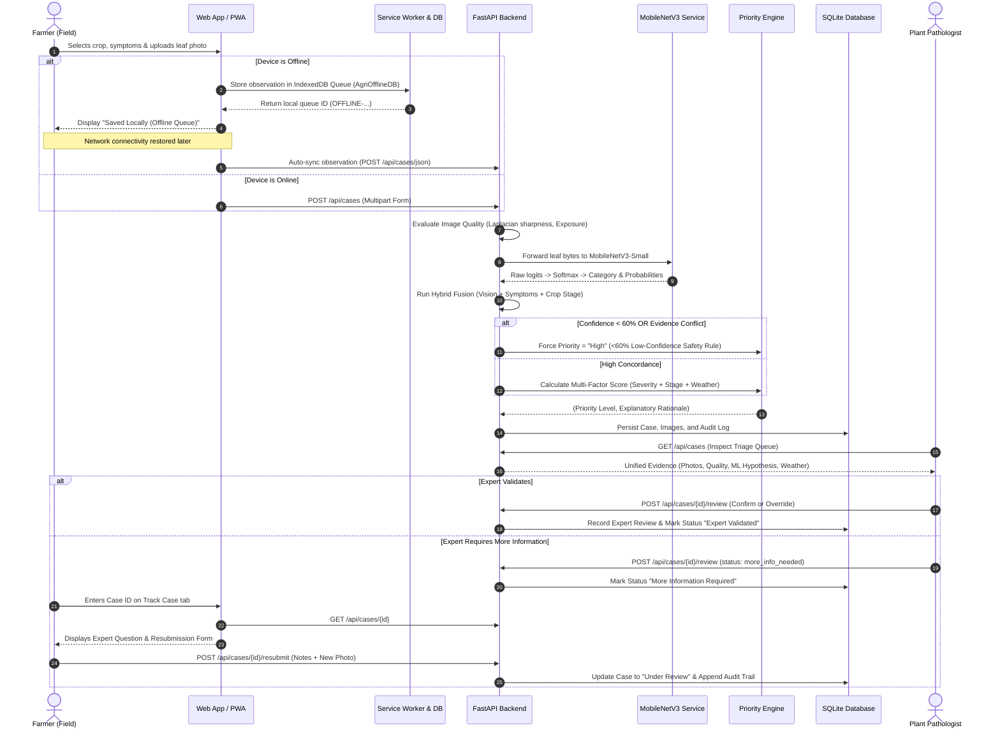

# System Architecture Specification

**Project:** Agricultural Disease Observation & Expert Escalation System  
**Stage:** Phase 2 Complete (~70% Scope: Hybrid Vision ML, Offline Workflow, Environmental Context & Case Tracking)  

---

## 1. Architectural Overview

The system provides a robust, privacy-preserving vertical slice connecting smallholder farmers, agricultural extension officers, and expert plant pathologists. In Phase 2, the architecture expands from the Phase 1 heuristic foundation to include:
1. **Real Computer Vision Model:** MobileNetV3-Small transfer learning running on-device or server CPU for foliar pathology classification.
2. **Hybrid Decision Support Layer:** Fuses computer vision probabilities with structured agronomic symptoms, growth stage vulnerabilities, and environmental stress signals.
3. **Environmental & Microclimate Context:** Captures recent rainfall, humidity, soil moisture/waterlogging, irrigation method, and field drainage to refine triage urgency.
4. **Offline-First Resilience:** Progressive Web App shell cached via Service Worker, with IndexedDB offline queueing, automatic reconnection detection, retry handling, and duplicate submission prevention.
5. **Farmer Case Tracking & Resubmission:** Transparent inquiry tracking allowing farmers to query case progress and resubmit clarifications or supplemental photos upon expert request.
6. **Authoritative Expert Governance:** Strict system invariant ensuring that agricultural agronomists hold exclusive diagnostic authority. All ML predictions are presented as preliminary non-diagnostic hypotheses.

---

## 2. System Architecture Diagram

```
+---------------------------------------------------------------------------------------------------------+
|                                         FARMER INTERFACE (PWA)                                          |
|  - 5-Step Intuitive Reporting Wizard (Large Cards, Visual Guidance, Audio-free Touch Interface)        |
|  - Case Tracking & Resubmission Station (Status Stepper, Clarification Upload, Expert Notes)           |
|  - Service Worker Cache (sw.js) for Offline Shell & Asset Persistence                                  |
|  - Client-Side IndexedDB Storage (AgriOfflineDB: drafts & queued observations)                         |
|  - Online / Offline State Machine with Auto-Sync & Idempotent Sync Tracking                            |
+---------------------------------------------------------------------------------------------------------+
                                                  |
                                   HTTPS / REST API (or Offline Queue)
                                                  v
+---------------------------------------------------------------------------------------------------------+
|                                       FASTAPI BACKEND SERVICE                                           |
|                                                                                                         |
|   +--------------------------+    +--------------------------+    +----------------------------------+  |
|   |   Image Quality Engine   |    |  MobileNetV3 Vision Svc  |    |  Hybrid Decision Support Engine  |  |
|   |  - Laplacian Variance    |    |  - MobileNetV3-Small     |    |  - Concordance Reinforcement     |  |
|   |  - Exposure Bounds       |--->|  - Raw Logits & Softmax  |--->|  - Conflict Penalty (<60%)       |  |
|   |  - Vegetation Ratio      |    |  - 5 Foliar Classes      |    |  - Image Quality Modulators      |  |
|   |  - Duplicate dHash       |    |  - ~10.5 ms CPU Latency  |    |  - "Preliminary Hypothesis" Only |  |
|   +--------------------------+    +--------------------------+    +----------------------------------+  |
|                                                                                   |                     |
|                                                                                   v                     |
|   +----------------------------------------------------------+    +----------------------------------+  |
|   |               SQLite Relational Data Layer               |    |     Priority Scoring Engine      |  |
|   |  - cases (Symptoms, Stage, Environmental Context, Prio)  |<---|  - Symptom Severity              |  |
|   |  - image_records (Paths, Quality Scores, Warnings)       |    |  - Crop Stage Vulnerability      |  |
|   |  - expert_reviews (Diagnosis, Urgency, Resubmission Req) |    |  - Low Confidence Escalation     |  |
|   |  - audit_logs (Immutable audit trail of transitions)     |    |  - Microclimate Stress Factor    |  |
|   +----------------------------------------------------------+    +----------------------------------+  |
+---------------------------------------------------------------------------------------------------------+
                                 |                                                 |
                                 v                                                 v
+------------------------------------------------+ +-----------------------------------------------------+
|          EXTENSION OFFICER DASHBOARD           | |            EXPERT VALIDATION WORKSTATION            |
|  - Multi-Criteria Triage Queue                 | |  - Unified 3-Column Inspection:                     |
|  - Real-time Priority Sorting (High/Med/Low)   | |      1. Field Evidence & Growth Stage               |
|  - T_review Comparative KPI Tracking           | |      2. Environmental & Microclimate Stress Context |
|  - Geographic & Crop Breakdown Charts          | |      3. Hybrid Vision Hypothesis vs Visual Images   |
|  - Low-Confidence Filter (<60% Escalations)    | |  - Authoritative Action: Confirm / Override / Info  |
+------------------------------------------------+ +-----------------------------------------------------+
                                 \                                                 /
                                  v                                               v
+---------------------------------------------------------------------------------------------------------+
|                                   METRICS & ERROR ANALYSIS ENGINE                                       |
|  - Empirical T_review: timestamp(expert review) - timestamp(first symptom reported)                     |
|  - MobileNetV3 Benchmark Metrics: Accuracy, Precision, Recall, Macro F1, Weighted F1, Confusion Matrix  |
|  - Transparent Attribution: Baseline Assumptions (120h) vs Targets (24h) vs Measured Prototype Results  |
+---------------------------------------------------------------------------------------------------------+
```

---

## 3. Mermaid Sequence Diagram: Hybrid Decision & Escalation Flow



---

## 4. Architectural Boundaries and Component Responsibilities

| Component | Technology | Primary Responsibility | Strict Boundary / Constraint |
| :--- | :--- | :--- | :--- |
| **Frontend Shell** | HTML5, CSS3, ES6 JavaScript | Farmer reporting, case tracking, officer triage, expert workstation | No frameworks required; runs in low-end mobile browsers. Zero PII collected. |
| **Offline Worker** | Service Worker API, IndexedDB | Shell asset caching, offline drafting, resilient background sync | Idempotent sync tracking; never silently discards unsynced observations. |
| **API Gateway** | FastAPI, Pydantic v2, Uvicorn | RESTful endpoints, request validation, serialization | Stateless; exposes clean OpenAPI 3.1 documentation. |
| **Vision Model** | PyTorch, MobileNetV3-Small | Single-image foliar pathology category probabilities | Raw logits during training; Softmax strictly at inference. CPU optimized (~10.5 ms). |
| **Hybrid Assistant** | Rule-Heuristic + ML Blending | Decision-support candidate hypothesis & calibrated confidence | Never presents diagnostic certainty. Confidence < 60% forces safety escalation. |
| **Priority Engine** | Deterministic Multi-Factor Rule Engine | Assigns High / Medium / Low triage queue priority | Triage priority only; never alters agronomic diagnosis. |
| **Database** | SQLite, SQLAlchemy 2.0 ORM | Relational case data, audit trails, reviews, image metadata | Schema additions implemented via non-destructive migrations. |
| **Image Storage** | Local filesystem (`data/uploads`) | Preserves uploaded photographs with privacy stripping | Metadata stripped; non-identifiable CC-BY-4.0 license applied. |
